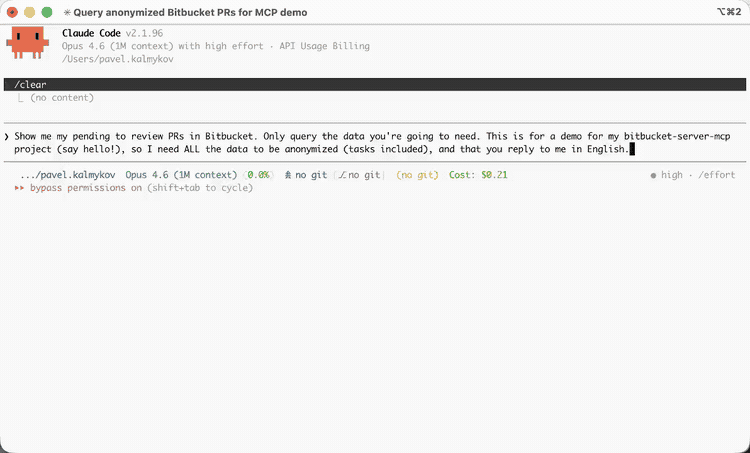

<div align="center">


[](https://www.npmjs.com/package/@pavel-kalmykov/bitbucket-server-mcp)
[](https://www.npmjs.com/package/@pavel-kalmykov/bitbucket-server-mcp)
[](https://github.com/pavel-kalmykov/bitbucket-server-mcp/actions/workflows/ci.yml)
[](https://codecov.io/gh/pavel-kalmykov/bitbucket-server-mcp-server)
[](https://github.com/pavel-kalmykov/bitbucket-server-mcp/actions/workflows/codeql.yml)
[](https://scorecard.dev/viewer/?uri=github.com/pavel-kalmykov/bitbucket-server-mcp)
[](https://nodejs.org)
[](https://www.typescriptlang.org/)
[](LICENSE)
[](https://www.atlassian.com/software/bitbucket/enterprise)

</div>

<div align="center">
  
</div>

## Quickstart

[](https://insiders.vscode.dev/redirect/mcp/install?name=bitbucket-server&inputs=%5B%7B%22id%22%3A%22bitbucket_url%22%2C%22type%22%3A%22promptString%22%2C%22description%22%3A%22Bitbucket%20Server%20URL%20%28e.g.%20https%3A//bitbucket.example.com%29%22%7D%2C%7B%22id%22%3A%22bitbucket_token%22%2C%22type%22%3A%22promptString%22%2C%22description%22%3A%22Bitbucket%20Personal%20Access%20Token%22%2C%22password%22%3Atrue%7D%5D&config=%7B%22command%22%3A%22npx%22%2C%22args%22%3A%5B%22-y%22%2C%22%40pavel-kalmykov/bitbucket-server-mcp%22%5D%2C%22env%22%3A%7B%22BITBUCKET_URL%22%3A%22%24%7Binput%3Abitbucket_url%7D%22%2C%22BITBUCKET_TOKEN%22%3A%22%24%7Binput%3Abitbucket_token%7D%22%7D%7D)
[](https://cursor.com/en/install-mcp?name=bitbucket-server&config=eyJjb21tYW5kIjoibnB4IiwiYXJncyI6WyIteSIsIkBwYXZlbC1rYWxteWtvdi9iaXRidWNrZXQtc2VydmVyLW1jcCJdLCJlbnYiOnsiQklUQlVDS0VUX1VSTCI6IllPVVJfQklUQlVDS0VUX1VSTCIsIkJJVEJVQ0tFVF9UT0tFTiI6IllPVVJfQklUQlVDS0VUX1RPS0VOIn19)
[](lmstudio://add_mcp?name=bitbucket-server&config=eyJjb21tYW5kIjoibnB4IiwiYXJncyI6WyIteSIsIkBwYXZlbC1rYWxteWtvdi9iaXRidWNrZXQtc2VydmVyLW1jcCJdLCJlbnYiOnsiQklUQlVDS0VUX1VSTCI6IllPVVJfQklUQlVDS0VUX1VSTCIsIkJJVEJVQ0tFVF9UT0tFTiI6IllPVVJfQklUQlVDS0VUX1RPS0VOIn19)

Or via Claude Code:

```console
claude mcp add bitbucket \
  -e BITBUCKET_URL=https://your-bitbucket-server.com \
  -e BITBUCKET_TOKEN=your-token \
  -- npx -y @pavel-kalmykov/bitbucket-server-mcp
```

## Requirements

- **Bitbucket Server / Data Center 8.5+** (may work on 7.x but untested)
- One of:
  - [Node.js](https://nodejs.org) >= 22.14 (via `npx`)
  - [Bun](https://bun.sh) (via `bunx`)
  - [Docker](https://www.docker.com)

## Installation

<details>
<summary><strong>VS Code</strong></summary>

Add to your workspace `.vscode/mcp.json`:

```json
{
  "servers": {
    "bitbucket": {
      "command": "npx",
      "args": ["-y", "@pavel-kalmykov/bitbucket-server-mcp"],
      "env": {
        "BITBUCKET_URL": "https://your-bitbucket-server.com",
        "BITBUCKET_TOKEN": "your-access-token"
      }
    }
  }
}
```

</details>

<details>
<summary><strong>Claude Desktop, Cursor, Windsurf, JetBrains, Neovim</strong></summary>

These clients all use the same `mcpServers` format. Add the JSON below to the config file for your client:

| Client | Config file |
|--------|------------|
| Claude Desktop | `~/Library/Application Support/Claude/claude_desktop_config.json` (macOS) or `%APPDATA%\Claude\claude_desktop_config.json` (Windows) |
| Cursor | `~/.cursor/mcp.json` ([one-click install](https://cursor.com/en/install-mcp?name=bitbucket-server&config=eyJjb21tYW5kIjoibnB4IiwiYXJncyI6WyIteSIsIkBwYXZlbC1rYWxteWtvdi9iaXRidWNrZXQtc2VydmVyLW1jcCJdLCJlbnYiOnsiQklUQlVDS0VUX1VSTCI6IllPVVJfQklUQlVDS0VUX1VSTCIsIkJJVEJVQ0tFVF9UT0tFTiI6IllPVVJfQklUQlVDS0VUX1RPS0VOIn19)) |
| Windsurf | `~/.codeium/windsurf/mcp_config.json` |
| JetBrains | Settings > Tools > AI Assistant > MCP, or `~/.junie/mcp/mcp.json` |
| Neovim | [mcphub.nvim](https://github.com/ravitemer/mcphub.nvim) `mcpservers.json` |

```json
{
  "mcpServers": {
    "bitbucket": {
      "command": "npx",
      "args": ["-y", "@pavel-kalmykov/bitbucket-server-mcp"],
      "env": {
        "BITBUCKET_URL": "https://your-bitbucket-server.com",
        "BITBUCKET_TOKEN": "your-access-token"
      }
    }
  }
}
```

</details>

<details>
<summary><strong>Zed</strong></summary>

Add to your Zed settings (`~/.config/zed/settings.json` on Linux, `~/Library/Application Support/Zed/settings.json` on macOS):

```json
{
  "context_servers": {
    "bitbucket": {
      "source": "custom",
      "command": "npx",
      "args": ["-y", "@pavel-kalmykov/bitbucket-server-mcp"],
      "env": {
        "BITBUCKET_URL": "https://your-bitbucket-server.com",
        "BITBUCKET_TOKEN": "your-access-token"
      }
    }
  }
}
```

</details>

<details>
<summary><strong>Docker</strong></summary>

For environments without Node.js:

```json
{
  "mcpServers": {
    "bitbucket": {
      "command": "docker",
      "args": [
        "run", "-i", "--rm",
        "-e", "BITBUCKET_URL=https://your-bitbucket-server.com",
        "-e", "BITBUCKET_TOKEN=your-access-token",
        "ghcr.io/pavel-kalmykov/bitbucket-server-mcp"
      ]
    }
  }
}
```

Or build locally: `docker build -t bitbucket-mcp .`

</details>

> [!TIP]
> [Bun](https://bun.sh) users can replace `npx -y` with `bunx` in any of the configs above.

## Tools

### Repositories

| Tool | Description |
|------|-------------|
| `list_projects` | List all accessible Bitbucket projects |
| `list_repositories` | List repositories in a project |
| `browse_repository` | Browse files and directories |
| `get_file_content` | Read file contents with pagination |
| `upload_attachment` | Upload a local file and get a markdown reference for PR comments |
| `get_server_info` | Get Bitbucket Server version and properties |

### Pull Requests

| Tool | Description |
|------|-------------|
| `create_pull_request` | Create a PR, including cross-repo from forks (`sourceProject`/`sourceRepository`). Auto-fetches default reviewers unless `includeDefaultReviewers: false`. |
| `get_pull_request` | Get PR details |
| `update_pull_request` | Safely update title, description, or reviewers (read-modify-write, preserves fields not explicitly changed) |
| `merge_pull_request` | Merge a PR with optional strategy (`no-ff`, `ff`, `ff-only`, `squash`, `rebase-no-ff`, `rebase-ff-only`, `squash-ff-only`) |
| `decline_pull_request` | Decline a PR |
| `list_pull_requests` | List PRs with filtering by state, author, direction |
| `get_dashboard_pull_requests` | List PRs across all repos for the authenticated user, filtered by role (`AUTHOR`/`REVIEWER`/`PARTICIPANT`), state, and review status |
| `get_pr_activity` | Get PR activity timeline, filtered by type (`all`, `reviews`, `comments`) |
| `get_diff` | Get PR diff with per-file truncation support. Use `stat: true` for a lightweight summary of changed files instead of the full diff. |

### Code Review

| Tool | Description |
|------|-------------|
| `manage_comment` | Unified create/edit/delete for PR comments. Supports inline anchoring (`filePath`/`line`/`lineType`), draft state (`state: PENDING`), task creation (`severity: BLOCKER`), threaded replies (`parentId`), and resolve/unresolve (`state: RESOLVED`/`OPEN`). |
| `submit_review` | Unified approve/unapprove/publish. Publish transitions all `PENDING` comments to visible and optionally sets `participantStatus` (`APPROVED`/`NEEDS_WORK`). |

### Branches & Commits

| Tool | Description |
|------|-------------|
| `list_branches` | List branches with default branch detection |
| `list_commits` | Browse commit history with branch and author filtering |
| `delete_branch` | Delete a branch (safety check prevents deleting default branch) |

### Search & Insights

| Tool | Description |
|------|-------------|
| `search` | Search code and files across repositories |
| `get_code_insights` | Fetch Code Insights reports (SonarQube, security scans) and annotations |
| `get_build_status` | Get CI build status (state, name, URL) by commit ID or PR. When using prId, resolves the latest commit automatically. |

### Prompts

| Prompt | Description |
|--------|-------------|
| `review-pr` | Step-by-step workflow for reviewing a PR: fetch details, read diff, check CI, create draft comments, and publish the review. Invoke via `/bitbucket:review-pr` in Claude Code. No arguments needed; the LLM asks for the PR interactively. You can add context, e.g. `/bitbucket:review-pr PR #42 in my-repo`. |

### Resources

| Resource | URI | Description |
|----------|-----|-------------|
| `projects` | `bitbucket://projects` | Cached list of all accessible projects (5 min TTL). Useful as ambient context without explicit tool calls. |

## Configuration

### Environment Variables

| Variable | Required | Description |
|----------|----------|-------------|
| `BITBUCKET_URL` | Yes | Base URL of your Bitbucket Server instance |
| `BITBUCKET_TOKEN` | Yes* | Personal access token |
| `BITBUCKET_USERNAME` | Yes* | Username for basic auth |
| `BITBUCKET_PASSWORD` | Yes* | Password for basic auth |
| `BITBUCKET_DEFAULT_PROJECT` | No | Default project key when not specified in tool calls |
| `BITBUCKET_READ_ONLY` | No | Set to `true` to disable all write operations |
| `BITBUCKET_CUSTOM_HEADERS` | No | Extra headers for all requests (`Key=Value,Key2=Value2`). Useful for Zero Trust tokens. |
| `BITBUCKET_DIFF_MAX_LINES_PER_FILE` | No | Max lines per file in diffs. Set to `0` for no limit. |
| `BITBUCKET_CACHE_TTL` | No | Cache duration in seconds (default: 300). Set to `0` to disable caching. |
| `BITBUCKET_ENABLED_TOOLS` | No | Comma-separated list of tool names to enable. If not set, all tools are available. |

*Either `BITBUCKET_TOKEN` or both `BITBUCKET_USERNAME` and `BITBUCKET_PASSWORD` are required.

### Read-Only Mode

Set `BITBUCKET_READ_ONLY=true` to restrict the server to read-only operations. Write tools (`create_pull_request`, `update_pull_request`, `merge_pull_request`, `decline_pull_request`, `manage_comment`, `submit_review`, `delete_branch`, `upload_attachment`) are disabled.

### Tool Filtering

Set `BITBUCKET_ENABLED_TOOLS` to load only specific tools, reducing context window usage:

```console
BITBUCKET_ENABLED_TOOLS=get_pull_request,get_diff,manage_comment,submit_review
```

### Response Curation

Read tools return compact responses by default, keeping only the fields an AI assistant typically needs. Every read tool accepts a `fields` parameter to customize:

- **Omit `fields`**: returns a curated summary (e.g. PR id, title, state, author, branches, reviewers, task count)
- **`fields: "*all"`**: returns the complete raw Bitbucket API response
- **`fields: "id,title,author.user.name"`**: returns exactly those fields (dot notation for nested paths)

### Caching

The server caches frequently accessed data in memory (project lists, repository metadata, default reviewers) to reduce API calls. The cache uses LRU eviction (max 500 entries) so memory stays bounded, and write operations automatically invalidate related entries.

By default, cached entries expire after 5 minutes. Configure with `BITBUCKET_CACHE_TTL` (in seconds), or set to `0` to disable caching entirely.

## Contributing

See [CONTRIBUTING.md](CONTRIBUTING.md) for development setup, architecture overview, and how to add new tools.

## License

Apache 2.0
